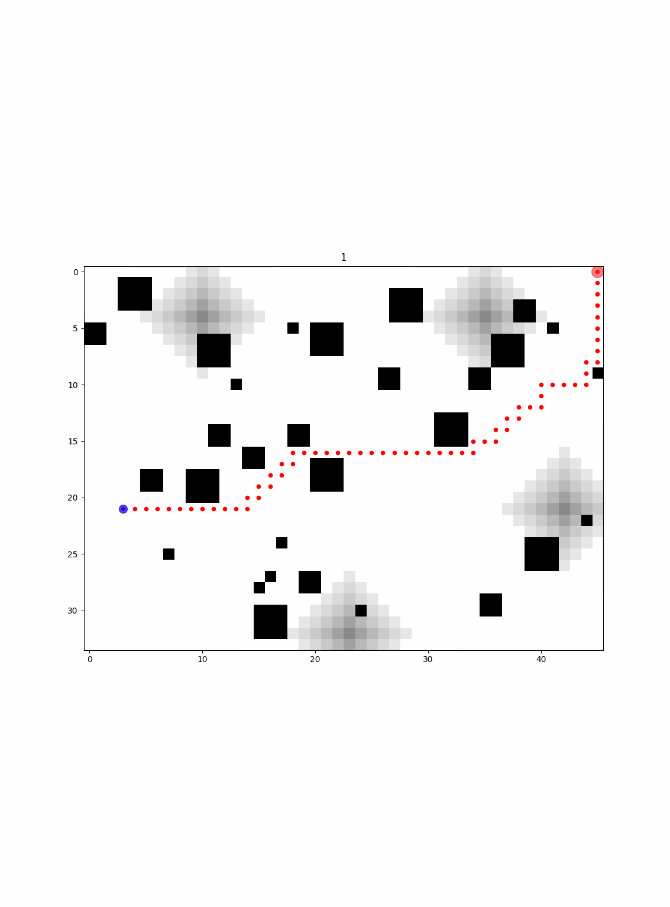

# paintbot-client-py

[Cygni](https://cygni.se/) hosted an extremely fun tournament where the task was to build a competitive bot.

They provided 4 language bindings, which where

- Java
- Go
- C#
- Javascript

[https://paintbot.cygni.se/#/readme](https://paintbot.cygni.se/#/readme)

But we felt they were "excluding" a lot of participants by not providing a python binding, so I created one, which I also used in the competition.

The client is taking advantage of asyncio (async/await) that came with **Python 3.6.5>** in order to use websockets as the message consumer/provider that talks with the tournament server.

Future ideas are to add middleware functionalities.

# Our_bot

The bot that we played with in the tournament was a bot implemented around [A\* Algorithm](https://en.wikipedia.org/wiki/A*_search_algorithm) - where we tried to put weights accordingly to some parameters we thought were of interest.

We also took full advantage of python extensive library support and visualized how **our_bot** where "thinking" via the use of mathplotlib.

Unfortunattly, we didn't win the tournament, but we managed to win when we played a match, where we met everyone.
